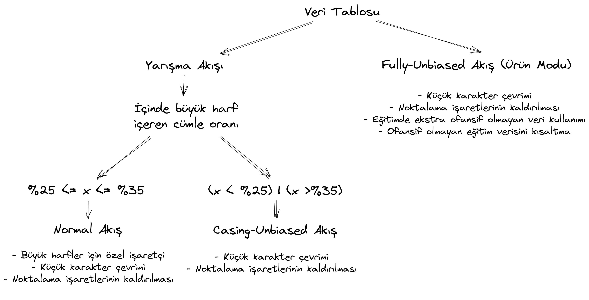

# Teknofest 2023 - Aşağılayıcı Söylemlerin Doğal Dil İşleme ile Tespiti
### Takım: L2 Regülasyon

---

### Nihai Çözüm Mimarisi ve Kullanılan Teknolojiler

---

## 1. Kullanılan Teknolojiler

### 1.1. Yazılım

---

Yarışma boyunca ekip üyelerinin tekrarlanabilir sonuçlar üretebilmeleri adına özel ayarlanmış Docker container'ları kullanılmıştır. Geliştirme ve server ortamında aynı ortamdan yararlanılmıştır. Docker container'ına ait bilgiler aşağıdaki gibidir.

**Base Image:** [nvcr.io/nvidia/pytorch:22.12-py3](https://catalog.ngc.nvidia.com/orgs/nvidia/containers/pytorch)

**Ekstra PIP Kütüphaneleri:**
- scikit-learn
- ipywidgets
- polars
- catboost
- lightgbm
- transformers
- datasets
- sentence-transformers
- zemberek-python
- gradio
- seaborn
- fasttext

---

### 1.2. Donanım
Geliştirme süreci boyunca ekip üyeleri tarafından kullanılan bilgisayarların özellikleri aşağıdaki gibidir:
- NVIDIA RTX4090, i9 9900K, 64GB RAM
- NVIDIA RTX3080, Ryzen 9 5900X, 128GB RAM
- Google Colab Pro (NVIDIA P100, 32GB RAM)

Yarışma demosu için [HuggingFace](https://huggingface.co/spaces/l2reg/Teknofest2023) kullanılmış olup açılmış olan server'a ait özellikler aşağıdaki şekildedir:
- NVIDIA T4
- 4 vCPU
- 15GB RAM

---

## 2. Nihai Çözüm Mimarisi

### 2.1. Temel Veri Analizi ve Önişleme
[Temel analizimiz](analysis/EDA.ipynb) sonucunda yarışmacılara sağlanan veri ile ilgili aşağıdaki çıkarımları yaptık:

- Bazı cümleler birden fazla sınıfa dahil olabilecekken problem multi-label değil de multi-class olarak tanımlandığı için etiketçinin inisiyatifine göre tek bir sınıfa atfedilmiş
- Şartnamede belirtilenin aksine dengeli bir etiket dağılımı mevcut değil
- Veride birkaç harften meydana gelen gürültü sayılabilecek örnekler mevcut
- Bazı kelimelerin sonuna bilinçli veya bilinçsiz şekilde noktalama işaretleri eklenmiş
- Verideki cümlelerin uzunluklarına baktığımızda belirgin bir sola-kayık dağılım görüyoruz
- `OTHER` kategorisine ait cümlelerin diğer sınıflara göre belirgin derecede daha uzun olduğunu görüyoruz
- `Ofansif Değil` şeklinde işaretlenip `Ofansiflik Tipi`ne sahip olan veya `Ofansif` şeklinde işaretlenip `Ofansiflik Tipi`ne sahip olmayan hatalı örnekler mevcut
- Çoğu tek harfli örneklerden meydana gelen bir alt veri kümesinin kopyalar barındırdığını görüyoruz
- Veride bir cümlede büyük harf içeren kelime oranı `%30` iken bunun `OTHER` sınıfında neredeyse `%0` olduğunu görüyoruz.

NLP modellerimizde hem ayrıklığı azaltmak hem de transformer modellerinin aynı boyutta sözlük dağarcığıyla daha fazla farklı kelimeyi temsil edebilmeleri adına küçük-harf dönüşümü kullandık. Fakat son bahsettiğimiz bulgudaki bilginin özel isim kullanımından doğmuş olabileceğini düşündük ve bu bilgiyi kaybetmek istemedik. Cümlelerdeki her büyük harfin başına özel `#` işaretçisi koyduk. Böylelikle hem küçük-harf modellerini kullanırken hem de büyük harf karakterlerden gerekli olan sinyali alabildik.

Bu bulgulardan yola çıkarak [Veri Üretimi](src/generate_data.py) ve [Veri Önişleme](src/utils/preprocess_utils.py) süreçlerimizi tasarladık. 

### 2.2. Eğitim-Doğrulama Süreci
Eğitim ve doğrulama sürecinde:
- **Cross-Validation:** Stratified 10-Fold
- **Skorlama:** Out-of-Fold yaklaşımı ile F1-Macro

ayarları kullanılarak [Model](src/models/README.md) dökümanında bahsedilen bütün modeller [create_model_zoo.sh](create_model_zoo.sh) kodu çalıştırılarak denendi. En başarılı modeller `embedding` katmanında `dbmdz-bert-base-turkish-128k-uncased` kullananlar oldu.

|Model|F1-Macro|F1-OTHER|F1-INSULT|F1-RACIST|F1-SEXIST|F1-PROFANITY|Ortalama Fold Eğitim Süresi|
|---|---|---|---|---|---|---|---|
|toxic-dbmdz-bert-base-turkish-128k-uncased|95.58	|96.63	|92.16	|96.67	|96.43	|95.99	|64.02 +- 0.4s|
|dbmdz-bert-base-turkish-128k-uncased (Fine-Tuned) Embeddings + svc|95.54	|96.59	|92.14	|96.71	|96.28	|95.98	|77.96 +- 0.53s|
|dbmdz-bert-base-turkish-128k-uncased (Fine-Tuned) Embeddings + lgbm|95.5	|96.62	|91.94	|96.6	|96.34	|96.01	|80.71 +- 0.42s|
|dbmdz-bert-base-turkish-128k-uncased (Fine-Tuned) Embeddings + xgb|95.48	|96.59	|91.94	|96.52	|96.41	|95.95	|76.52 +- 0.33s|
|dbmdz-bert-base-turkish-128k-uncased (Fine-Tuned) Embeddings + catboost|95.44	|96.51	|91.91	|96.69	|96.15	|95.95	|81.57 +- 0.31s|

Hem en iyi performansı gösterdiği, hem de diğer 4 çözüme karşı yek bir mimariye sahip olduğu için doğrudan `toxic-dbmdz-bert-base-turkish-128k-uncased` olarak isimlendirdiğimiz modeli kullanmaya karar verdik. İlgili modelin yapısına [Model](src/models/README.md) dökümanında `BERT` sekmesi altından ulaşabilirsiniz. Seçilen model aşağıdaki ayarlar ile eğitildi:
- **Epoch:** 3
- **Learning Rate:** 7e-5
- **Batch-Size:** 64
- **Tokenizer Length:** 64
- **Loss**: BCE
- **Online Hard Example Mining**: Açık
- **Class-Weighting**: Açık (^0.3)
- **Early Stopping**: Kapalı
- **Stratified Batch Sampling**: Açık
- **LR Scheduler:** Cosine-with-Warmup
- **Warmup Ratio:** 0.1
- **Weight Decay:** 0.01
- **LLRD:** 0.95
- **Label Smoothing:** 0.05
- **Gradient Clipping:** 1.0
- **MLM Pre-Training:** Kapalı

## 2.3. Final Modeller

[İlgili dökümanda](src/README.md) `Model-Data Unbiasing` bölümünde bahsettiğimiz model önyargılarının bazıları sonucu büyük ölçütte değiştiriyordu. Bu yüzden 3 farklı versiyon tasarlamaya karar verdik. Yukarıda belirtilen önişlemeleri yaptıktan sonra aldığımız sonuçlar ise aşağıdaki gibidir:

|Model|F1-Macro|F1-OTHER|F1-INSULT|F1-RACIST|F1-SEXIST|F1-PROFANITY|Ortalama Fold Eğitim Süresi|
|---|---|---|---|---|---|---|---|
|toxic-dbmdz-bert-base-turkish-128k-uncased|95.58	|96.63	|92.16	|96.67	|96.43	|95.99	|64.02 +- 0.4s|
|toxic-dbmdz-bert-base-turkish-128k-uncased-casing-unbiased|94.86	|95.38	|91.2	|95.94	|95.93	|95.87	|63.05 +- 0.43s|
|toxic-dbmdz-bert-base-turkish-128k-uncased-fully-unbiased|93.36	|91.97	|89.29	|94.88	|94.86	|95.79	|93.81 +- 1.59s|

Malesef verinin geneline yayılmış bir yanlılık görüyoruz. Bunun sebebi verinin toplandığı kaynakların çeşitsizliği veya toplama zamanının darlığı olabilir. Modeldeki önyargıyı azaltmak adına yaptığımız her hamle eğitim seti genelinde aldığımız skoru düşürdü. Bu yüzden soldaki iki model kolunu yarışmada aktif tahminlerimiz için kullandık. Fakat model ürünleştirildiği takdirde sağdaki modelin daha doğru çalışacağını öngörüyoruz.
